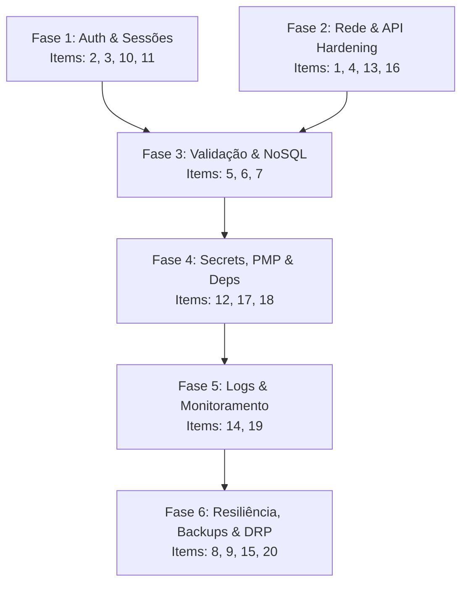

# Master Spec: Requisitos Mínimos de Segurança (Security Hardening)

> **Contexto:** Especificação técnica e arquitetural baseada nos 20 pilares essenciais de segurança para transformar o app **Gastos do Casal** em uma aplicação robusta, confiável e protegida contra ameaças comuns do OWASP Top 10 e riscos de infraestrutura na nuvem.

---

## 1. Problem Statement (Diagnóstico do Cenário Atual)

Atualmente, o projeto **Gastos do Casal** opera com foco em simplicidade e agilidade local/doméstica:
1. **Ausência de Autenticação e Autorização:** Qualquer pessoa com acesso à URL da API (`/api/receipts`, `/api/receipts/all`) pode consultar despesas, alterar status, fechar faturas ou até mesmo deletar todo o banco de dados sem nenhuma credencial.
2. **Sem Proteção de Camada de Rede & Rate Limiting:** A API não possui limitação de taxa (`rate-limiting`), tornando-a vulnerável a ataques de força bruta, spam de requisições ou esgotamento da cota de leitura/escrita do Cloud Firestore.
3. **CORS Permissivo:** O middleware CORS atual permite requisições sem `origin` (como chamadas diretas via `curl`, Postman ou scripts maliciosos).
4. **Validação e Sanitização Frágeis:** O backend realiza apenas checagens triviais (`if (!data.store && !data.type)`). Não há validação de esquema de dados (Schema Validation), tipagem estrita de payloads ou sanitização contra Cross-Site Scripting (XSS).
5. **NoSQL / Field Injection no Firestore:** O repositório faz `merge: true` com objetos recebidos diretamente do cliente, permitindo sobrescrita de campos arbitrários ou poluição de documentos.
6. **Falta de Observabilidade e Auditoria:** Os logs utilizam `console.log` simples sem estrutura JSON, sem identificador de correlação (Request ID) e sem registro de auditoria para operações destrutivas.
7. **Sem Automação de Migrações e Backups:** Alterações no modelo de dados são feitas em tempo de execução sem versionamento de schema; não há rotina automatizada de backup no GCP Cloud Storage nem Plano de Recuperação de Desastres (DRP) documentado.

---

## 2. Mapa dos 20 Requisitos de Segurança aplicados ao Projeto

| # | Requisito da Imagem | Aplicação Específica no "Gastos do Casal" | Fase / Issue |
|---|---|---|---|
| **1** | **HTTPS** | Enforçar TLS 1.3 no Render/Firebase Hosting, HSTS headers via `helmet`, redirecionamento obrigatório HTTP -> HTTPS. | Issue 02 |
| **2** | **Senhas com Hash** | Utilizar algoritmo moderno (`argon2` ou `bcrypt` com work-factor $\ge 12$) com salt único por usuário; nunca trafegar ou persistir senhas em texto puro. | Issue 01 |
| **3** | **MFA** | Autenticação Multifator (2FA) via TOTP (RFC 6238 - Google Authenticator/Authy) ou Firebase Auth MFA para acesso administrativo/financeiro. | Issue 01 |
| **4** | **Rate Limit** | Middleware `express-rate-limit` diferenciado: proteção global contra DDoS/scrapers e proteção estrita em rotas sensíveis (auth, `deleteAll`, `closeCycle`). | Issue 02 |
| **5** | **Validação de Inputs** | Validação centralizada com `Zod` em todas as rotas (body, params, query); rejeitar dados não esperados (*strict parsing*). | Issue 03 |
| **6** | **Sanitização de Dados** | Sanitização de strings em campos textuais (`store`, `description`, `notes`) com `DOMPurify` / `xss` no backend e escape estrito no frontend. | Issue 03 |
| **7** | **SQL / NoSQL Injection** | Bloqueio de injeção em NoSQL (Firestore) com DTOs explícitos (*whitelist* de propriedades) antes do `.set()` ou `.update()`. | Issue 03 |
| **8** | **Migrations** | Mecanismo de migração de schema idempotente para o Firestore com histórico de versão em `_schema_migrations` e suporte a *dry-run*. | Issue 06 |
| **9** | **Rollback** | Estratégia de rollback automatizado de código (Render Blue/Green ou Git Revert) e scripts de migração compensatória (*down migrations*). | Issue 06 |
| **10** | **Controle de Acesso (RBAC)** | Middleware `authMiddleware` protegendo todas as rotas `/api/*`; isolamento por perfil e household/casal (*tenant isolation*). | Issue 01 |
| **11** | **Expiração de Sessão** | Tokens de acesso curtos (JWT de 15 a 60 min) + Refresh Tokens seguros com cookies `HttpOnly`, `SameSite=Strict`, `Secure`. | Issue 01 |
| **12** | **Secrets** | Gestão de segredos com `.env.example`, validação de variáveis no boot (`dotenv-safe`/`zod`), `.gitignore` reforçado na raiz e uso de Secrets do Render/GCP. | Issue 04 |
| **13** | **CORS** | Configuração restritiva sem fallback permissivo; lista branca explícita de origens (domínio de produção e localhost dev). | Issue 02 |
| **14** | **LOGS (Auditoria)** | Logger estruturado (`pino`) com rastreamento por `correlationId`, mascaramento automático de PII (senhas, chaves PIX) e log de auditoria financeiro. | Issue 05 |
| **15** | **Backup's** | Rotina automatizada de exportação do Cloud Firestore para bucket do Google Cloud Storage (`gs://gastos-casal-backups`) com retenção de 30 dias. | Issue 06 |
| **16** | **Criptografia** | Criptografia em trânsito (TLS) e em repouso (Google Cloud KMS/Firestore); hashing de senhas e proteção de chaves de API. | Issue 02 |
| **17** | **Dependências** | Análise contínua de vulnerabilidades (`npm audit`, GitHub Dependabot e CI via GitHub Actions para bloqueio de CVEs críticas). | Issue 04 |
| **18** | **PMP (Menor Privilégio)** | Credenciais do Service Account do Firebase restritas exclusivamente ao Firestore (`roles/datastore.user`), sem privilégios de Owner/Editor no GCP. | Issue 04 |
| **19** | **Monitoramento** | Endpoint `/health` enriquecido (uptime, status de conexão com Firestore, memória), telemetria e integração com ferramenta de monitoramento (Sentry/Logtail). | Issue 05 |
| **20** | **Plano de Recuperação (DRP)** | Documento formal de Disaster Recovery (`DRP.md`) contendo procedimentos de restauração passo a passo, métricas RPO (< 24h) e RTO (< 1h). | Issue 06 |

---

## 3. Divisão em Fases de Execução

As 20 frentes de trabalho foram agrupadas em 6 sub-issues decoupled para implementação progressiva sem downtime:

---

## 4. User Stories

1. **Como usuário do casal**, quero que meus dados financeiros estejam protegidos por login e senha seguros (com suporte a segundo fator), para que pessoas não autorizadas na internet não consigam ver meus gastos.
2. **Como administrador do sistema**, quero que tentativas excessivas de login ou acessos suspeitos sejam bloqueados por rate limit, para evitar ataques de força bruta.
3. **Como usuário**, quero que minhas sessões expirem após inatividade prolongada, garantindo que ninguém acesse o app em caso de aparelho compartilhado esquecido.
4. **Como desenvolvedor**, quero que todos os dados enviados pela interface sejam validados por esquemas rígidos no servidor, evitando que payloads corrompidos ou maliciosos cheguem ao banco de dados.
5. **Como mantenedor da infraestrutura**, quero que backups diários do banco sejam realizados e que haja um plano documentado de recuperação, para que possamos restaurar a base em menos de 1 hora em caso de falha crítica.
